<!-- ══════════════ BANNER · BOOT SEQUENCE ══════════════ -->

<div align="center">
  
</div>

<br/>

<!-- ══════════════ TYPING ANIMATION ══════════════ -->

<div align="center">
  <a href="https://ramosdev-tech.vercel.app">
    
  </a>
</div>

<div align="center">
  
  
  
</div>


<!-- ══════════════ SOBRE MIM ══════════════ -->

## `◈` SOBRE MIM

<table>
<tr>
<td width="58%" valign="top">

Sou **Alfredo Ramos**, desenvolvedor fullstack com foco em Inteligência
Artificial, estudante de Engenharia de Software em Maceió e freelancer
para clientes reais desde antes de me formar.

Meu trabalho é pegar processo manual e transformar em sistema: site de
cliente, CRM, bot de automação, análise de dados. Se dá pra automatizar,
eu automatizo.

```yaml
nome:         "Alfredo Ramos de Albuquerque Filho"
localizacao:  "Maceió, AL · Brasil"
funcao:       "Desenvolvedor Fullstack · foco em IA"
formacao:     "Eng. de Software · UMJ · dez/2028"
foco_atual:   ["IA aplicada", "automação", "segurança"]
stack_core:   ["Next.js", "React", "Node", "Python", "Supabase"]
projeto_solo: "Radar de Promoções"
disponivel:   "estágio em TI"
```

</td>
<td width="42%" valign="top">

<div align="center">
  
</div>

**No que estou metido**

- `▸` Sites e sistemas para clientes
- `▸` CRM em Next.js + Supabase
- `▸` Bot de automação em Node.js
- `▸` Análise de dados com Python e Pandas
- `▸` Segurança: RLS, IDOR, controle de acesso

**Fora do código**

- `▸` Cofundador da associação de e-sports da UMJ
- `▸` Tráfego pago e marketing de afiliados
- `▸` Cursos de cibersegurança e engenharia de dados

</td>
</tr>
</table>


<!-- ══════════════ TECH STACK ══════════════ -->

## `◈` TECH STACK

<div align="center">

**Linguagens**


**Frontend**


**Backend & Dados**


**Cloud & DevOps**


**Dados & Análise**


</div>

<details>
<summary><b>◈ Ver detalhe por domínio</b></summary>

<br/>

<div align="center">

| Domínio | Stack principal | Nível |
|:--|:--|:--|
| **Dados / Python** | Python · Pandas · SQL | `██████████░░` Avançado |
| **Frontend** | Next.js · React · Tailwind | `█████████░░░` Intermediário+ |
| **Backend** | Node.js · Supabase · Postgres | `████████░░░░` Intermediário+ |
| **Segurança** | RLS · IDOR · controle de acesso | `███████░░░░░` Intermediário |
| **DevOps** | Docker · Vercel · Cloudflare | `███████░░░░░` Intermediário |

</div>

</details>


<!-- ══════════════ FERRAMENTAS ══════════════ -->

## `◈` FERRAMENTAS DO DIA A DIA

<div align="center">


<br/>


</div>


<!-- ══════════════ PROJETOS ══════════════ -->

## `◈` PROJETOS EM DESTAQUE

<div align="center">

<a href="https://github.com/alfredoramosdev/Estudos-de-IA">
  
</a>
<a href="https://github.com/alfredoramosdev/analise-dados-python">
  
</a>
<br/>
<a href="https://github.com/alfredoramosdev/DashboardClima">
  
</a>
</div>

<details>
<summary><b>◈ Contexto de cada projeto</b></summary>

<br/>

| Projeto | O que é | Stack | Status |
|:--|:--|:--|:--|
| **Estudos-de-IA** | Aprendendo IA do zero: projetos, anotações e experimentos de aprendizado. | `Python` `ML` `LLMs` | 🟢 Ativo |
| **analise-dados-python** | Análise de dados de vendas: limpeza, tabelas dinâmicas e gráficos. | `Python` `Pandas` `Colab` | 🟢 Público |
| **DashboardClima** | Dashboard de clima consumindo API em tempo real. | `JavaScript` `HTML/CSS` | 🟢 Público |

**Trabalhos para clientes**

| Cliente | Entrega | Link |
|:--|:--|:--|
| **Bem Mais Sorrir** | Site para clínica odontológica com duas unidades em Maceió. | [bemmaissorrir.vercel.app](https://bemmaissorrir.vercel.app) |
| **Jeff Studios** | CRM completo com auditoria de segurança e correção de falhas de RLS. | privado |
| **Alenilton Barbearia** | Site institucional dark mode, com preços, avaliações e deploy configurado. | privado |

</details>


<!-- ══════════════ OBJETIVOS · TERMINAL ══════════════ -->

## `◈` OBJETIVOS ATUAIS

```bash
┌─[ alfredoramosdev@core ]─[ ~/roadmap ]
└─$ cat objetivos.log

  [██████████] 100%  ▸ montar portfólio online ................ CONCLUÍDO
  [██████████] 100%  ▸ certificações de IA (DIO) .............. CONCLUÍDO
  [████████░░]  80%  ▸ entregar CRM do cliente ................ EM ANDAMENTO
  [██████░░░░]  60%  ▸ escalar o Radar de Promoções .......... EM ANDAMENTO
  [█████░░░░░]  50%  ▸ cursos Oxetech · cibersegurança ........ EM ANDAMENTO
  [███░░░░░░░]  30%  ▸ conseguir estágio em TI ................ EM BUSCA
  [░░░░░░░░░░]   0%  ▸ formar em Eng. de Software ............. dez/2028

└─$ status --resumo

  em_foco     : "IA aplicada a produto real"
  aprendendo  : "cibersegurança e engenharia de dados"
  construindo : "automações que rodam sem eu estar junto"
  disponivel  : "estágio, freelance e open source"

└─$ _
```


<!-- ══════════════ MÉTRICAS ══════════════ -->

## `◈` MÉTRICAS DO SISTEMA

<div align="center">


<br/><br/>


<br/><br/>


</div>


<!-- ══════════════ TROPHIES ══════════════ -->

## `◈` CONQUISTAS

<div align="center">
  
</div>


<!-- ══════════════ SNAKE ══════════════ -->

## `◈` CONTRIBUTION SNAKE

<div align="center">
  <picture>
    <source media="(prefers-color-scheme: dark)" srcset="https://raw.githubusercontent.com/alfredoramosdev/alfredoramosdev/output/snake-dark.svg"/>
    <source media="(prefers-color-scheme: light)" srcset="https://raw.githubusercontent.com/alfredoramosdev/alfredoramosdev/output/snake.svg"/>
    
  </picture>
</div>


<!-- ══════════════ REDES ══════════════ -->

## `◈` CANAIS DE COMUNICAÇÃO

<div align="center">

<a href="https://ramosdev-tech.vercel.app">
  
</a>
<a href="https://www.linkedin.com/in/alfredo-ramos-899328368/">
  
</a>
<a href="mailto:alfredocontato2@gmail.com">
  
</a>
<br/>
<a href="https://instagram.com/ramosdev_">
  
</a>
<a href="https://github.com/alfredoramosdev">
  
</a>

<br/><br/>


</div>

<!-- ══════════════ RODAPÉ ══════════════ -->

<div align="center">

<br/>

`" Se dá pra automatizar, não faz na mão. "`

<br/>


<sub>`◈` Maceió, AL · Brasil `◈`</sub>

</div>
